# native、方法区

**native**

凡是带了`native`关键字的：

- 说明Java的作用范围达不到了，要去调用底层C语言的库。
- 会进入本地方法栈，调用本地方法接口（JNI）

native关键字的由来：因为java出生的年代里C、C++横行，如果java能够调用C、C++库中的方法即能有胜出的机会，于是出现native关键字来实现这个功能。

JNI的作用就是扩展Java的使用，融合不同的编程语言为java所用

Java在内存区域中专门开辟了一块标记区域（Native method stack），用来登记native方法，在最终执行引擎执行的时候通过JNI加载本地方法库中的方法。

**方法区**

方法区是被所有线程共享，所有字段和方法字节码，以及一些特殊方法，比如构造函数，接口代码也在此定义。

所有定义的方法的信息都保存在该区域，此区域属于共享区。

静态变量、常量、类信息（构造方法、接口定义）、运行时的常量池存在方法区中，但是实例变量存在堆内存中，和方法区无关

static、final、Class模板、常量池

# 栈

一种数据结构，遵循FILO原则

执行引擎每调用一个函数就会这个函数创建一个对应的栈帧并加入到虚拟机栈中，函数从调用到执行结束对应着栈帧的入栈和出栈过程。

栈内存主管程序的运行，生命周期和线程同步；

线程结束，栈内存也就跟着释放。对于栈来说不存在垃圾回收问题。

栈里放的啥：8大基本类型+对象引用+实例方法

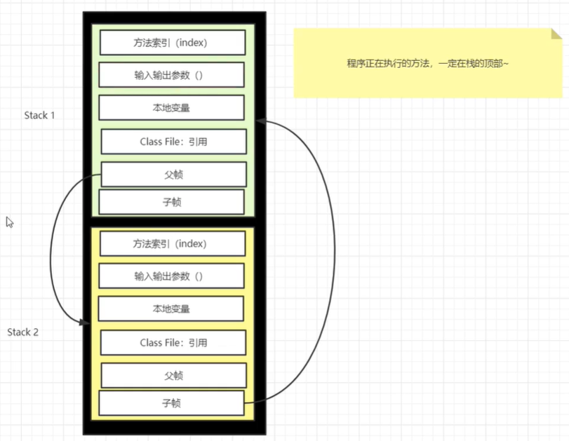

**对象实例化过程**

1. JVM会去读取指定路径下的Person.class文件，并加载进内存，并会先加载Person的父类（如果有直接父类的情况下）
2. 在堆内存中开辟空间，分配地址。
3. 并在对象空间中，对对象中的属性进行默认初始化
4. 调用对应的构造函数，进行初始化
5. 在构造函数中，第一行会先调用父类中的构造函数进行初始化（如果没有显式调用父类的构造函数，默认第一行将调用父类无参构造函数：super()）
6. 父类初始化完毕后，再对子类的属性，进行显示初始化。(在定义类属性时的初始化如：String sex=“boy”?
7. 指定构造函数中的初始化
8. 初始化完毕后，将堆内存中的地址值赋给引用变量。

# 堆

一个JVM只有一个堆内存，堆内存的大小是可以调节的。堆被所有线程共享。

类加载器读取了类文件后，一般会把什么东西放到堆中？放的是对象的实例。

堆内存中还要分为三个区域：

- 新生区（伊甸园区）Young/New
- 养老区   old
- 永久区   Perm

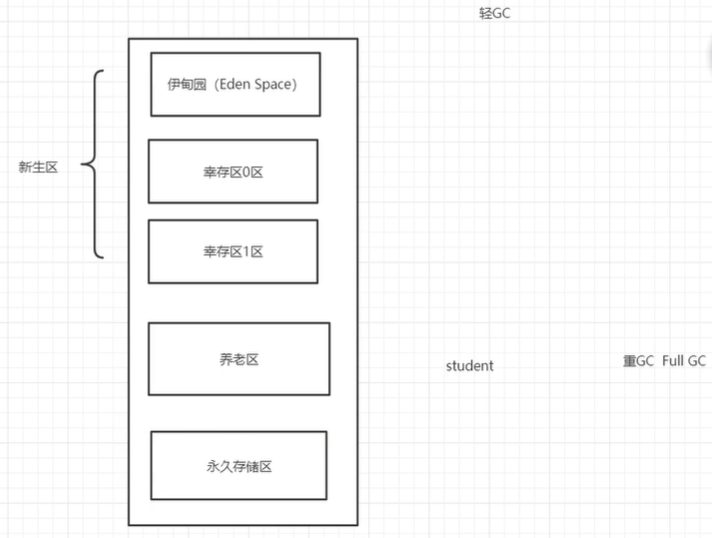

GC垃圾回收，主要是在伊甸园区和养老区

假设内存满了，OOM，堆内存不够。

在JDK8以后永久存储区改了个名字叫元空间

**新生区**

- 类诞生和成长的地方，甚至死亡；
- 伊甸园区，所有的对象都是在伊甸园区new出来的
- 幸存区（分为0区和1区）

在轻GC清理伊甸园区的过程中活下来的对象放到幸存区。如果新生区满了，在重GC清理新生区的过程中活下来的对象放到养老区。

**永久区**

这个区域常驻内存，用来存放JDK自身携带的Class对象。interface元数据，存储的是java运行时的环境和类信息，这个区域不存在垃圾回收，关闭JVM就会释放这个区域的内存

- JDK1.6之前：永久代，这个时候常量池在方法区中
- JDK1.7：永久代，但是慢慢的退化了，去永久代，常量池在堆中。
- JDK1.8之后：无永久代，常量池在元空间

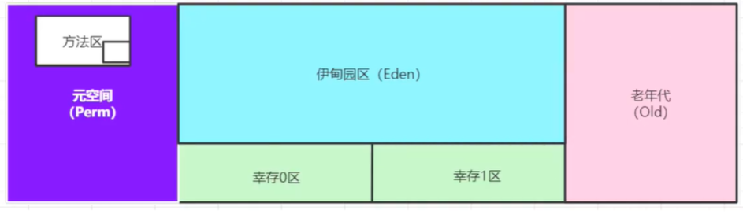

元空间存在本地内存中，不在JVM内存。

默认情况下，分配的总内存是电脑内存的1/4，初始化内存是1/64

**堆内存调优**

如果爆出OOM问题

1. 尝试扩大堆内存看结果， VM option：`-Xms1024m -Xmx1024m -XX:+PrintGCDetails`
2. 如果扩大堆内存还报错，则通过工具来分析内存，看哪段代码出问题了

通过jprofiler：

- 分析Dump内存文件，快速定位内存泄露
- 获得堆中的数据
- 获得大的对象

# GC

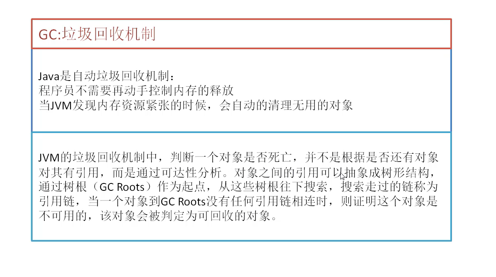

GC的作用区域在堆和方法区

JVM在进行GC时，并不是对这三个区域统一回收，大部分是对新生区进行回收

GC分为两种类：轻GC和重GC

GC的算法有哪些？标记清除法，标记压缩，复制算法，引用计数法，怎么用的？

**引用计数法**

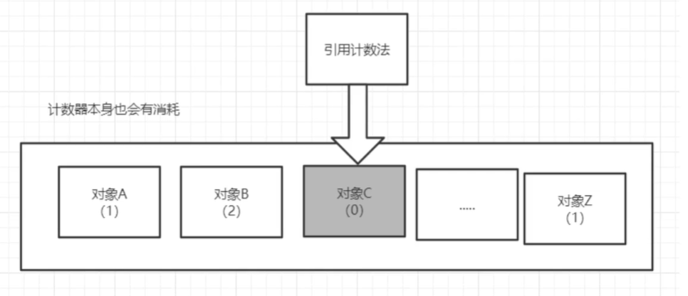

**复制算法**

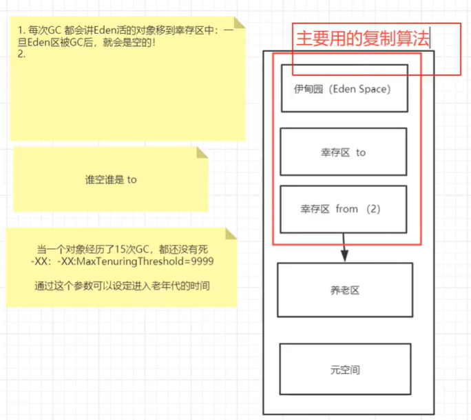

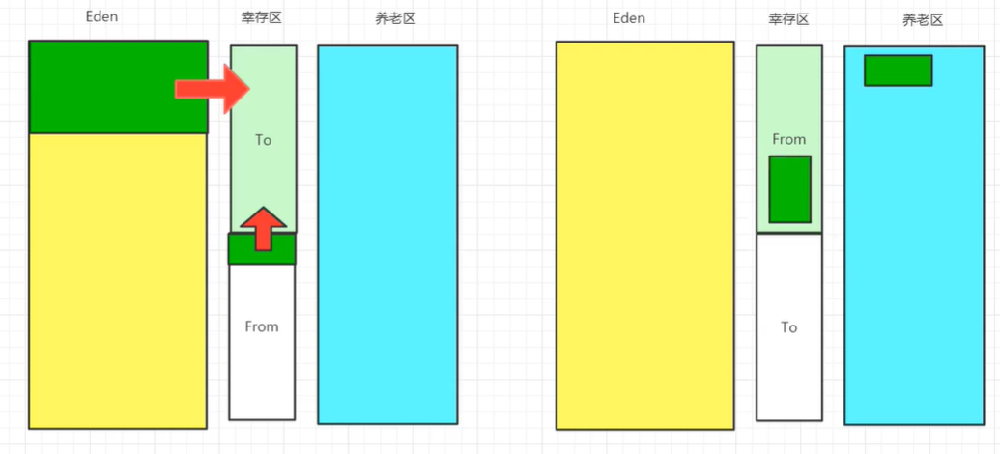

每次GC清理之后，空的总是伊甸园区和from区

好处：没有内存的碎片

坏处：浪费了内存空间（多了一半区域是空的，to区）

复制算法最佳使用场景：对象存活度较低的时候，新生区

**标记清除算法**

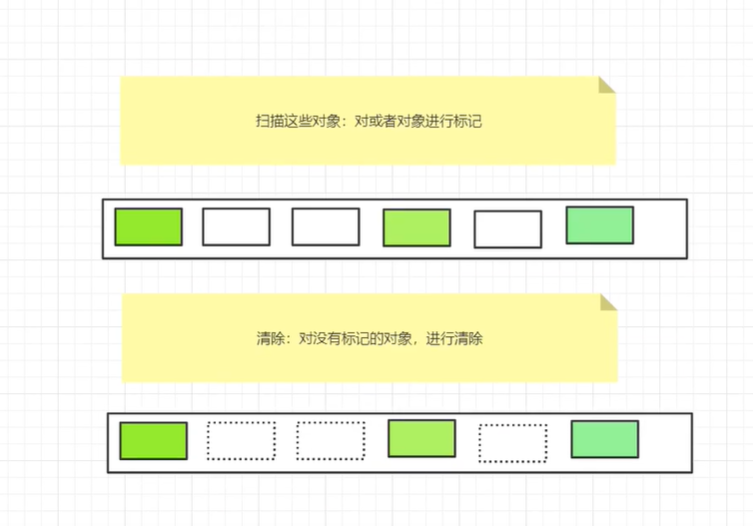

优点：不需要额外的空间

缺点：两次扫描，耗时，会产生内存碎片

**标记压缩**

基于标记清除再优化：

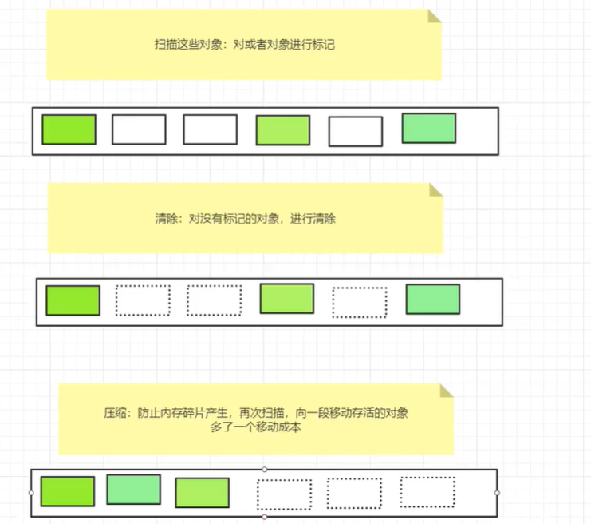

**总结**

内存效率：复制算法>标记清除>标记压缩（时间复杂度）

内存整齐度：复制算法=标记压缩>标记清除

内存利用率：标记压缩=标记清除>复制算法

新生代：

- 存活率低
- 复制算法

老年代：

- 区域大，存活率高
- 标记清除+标记压缩混合实现

# JVM与Java体系结构

## JVM体系结构

HotSpot采用解释器与即时运行器并存的架构

多个线程共享堆和方法区

Java栈、本地方法栈、程序计数器是每个线程所私有的

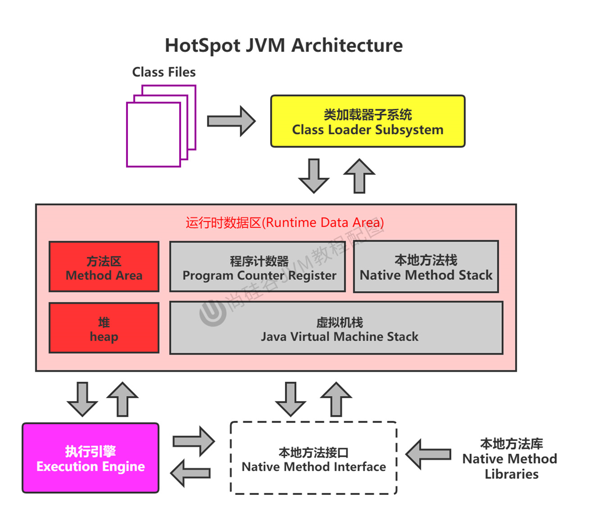

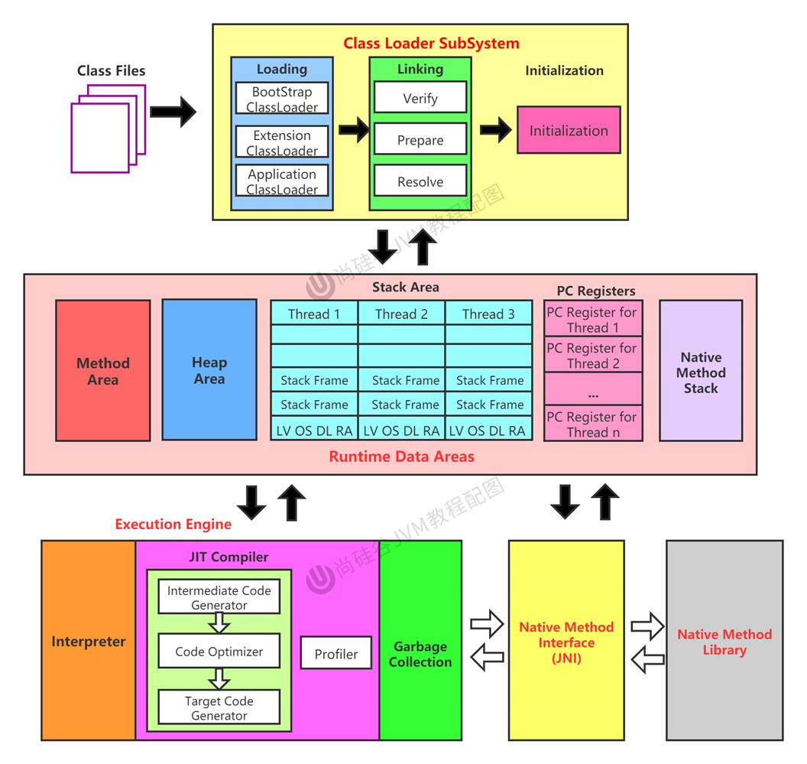

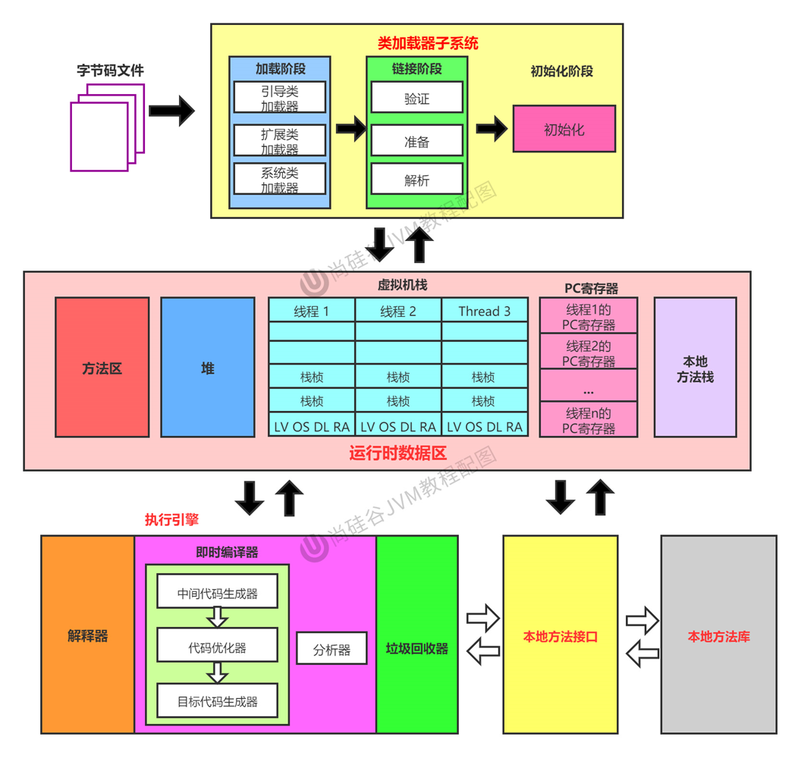

## **JVM的架构模型** 

Java编译器输入的的指令流是基于栈的指令集架构，另一种是基于寄存器的指令集架构。

栈架构特点

- 可移植性好
- 指令集小、指令多、大部分是零地址指令
- 执行性能比寄存器差
- 实现同样的功能需要更多的指令

寄存器架构特点

- 完全依赖硬件，可移植性差
- 性能优秀、执行效率高
- 指令集以一地址指令、二地址指令、三地址指令为主。

## JVM生命周期

虚拟机的启动→虚拟机的执行→虚拟机的退出

Java虚拟机的启动是通过引导类加载器（bootstrap class loader）创建一个初始类来完成的，这个初始类是由虚拟机的具体实现指定的。

执行Java程序的本质就是执行的虚拟机进程

**常见的JVM**

- Sun公司，HotSpot，默认虚拟机
- Sun Classic VM（世界上第一款商用，JDK1.4被淘汰，只提供解释器）
- Exact VM（JDK1.2出现，）
- BEA ，JRockit（专注于服务器端，内部不含解析器实现，世界最快）
- IBM， J9 VM

# 类加载子系统

## 类加载子系统作用

- 负责从文件系统或者网络中加载class文件，class文件在文件开头有特定的文件标识。
- ClassLoader只负责文件的加载，是否可以运行由执行引擎决定。
- 加载的类信息存放在方法区。方法区中还会存放运行时常量池信息，可能包括字符串、字面量、数字常量（这部分常量信息是Class文件中常量池部分的内存映射）

## 类加载过程

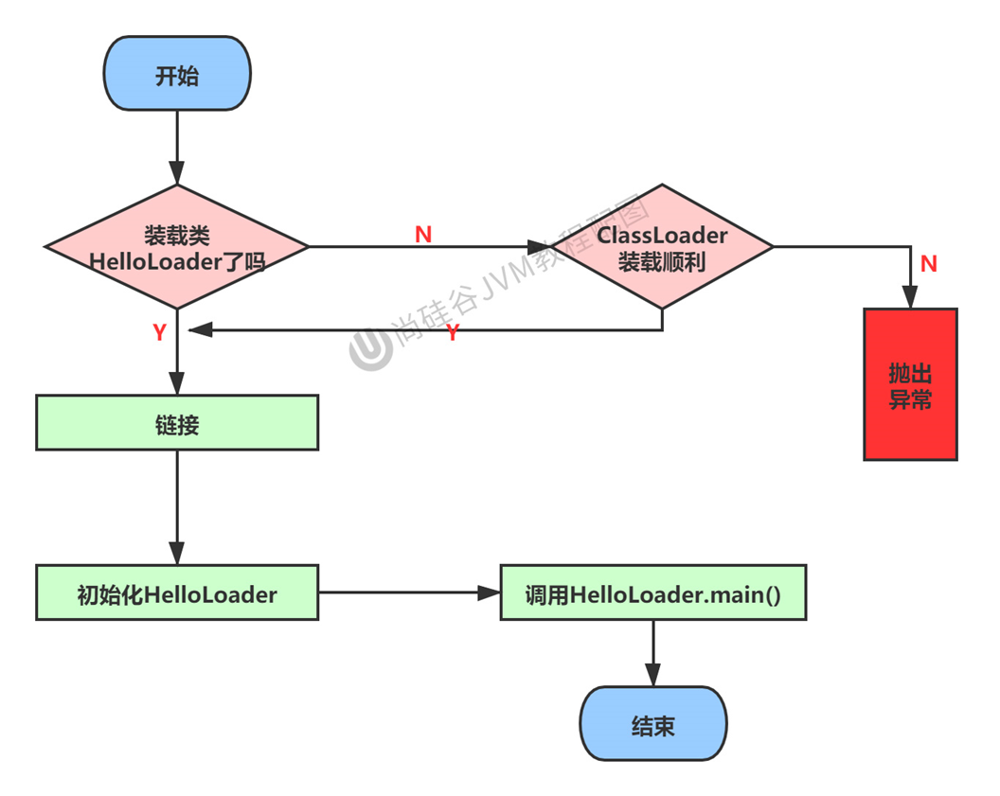

**加载：**

1. 通过一个类的全限定名获取定义此类的二进制字节流。
2. 将这个字节流所代表的静态存储结构转化为方法区的运行时数据结构。
3. 在内存中生成一个代表这个类的Class对象，作为方法区这个类的所有数据的访问入口。

**链接：**

1. 验证（verify）：查看Class文件字节流中包含的信息是否符合要求，保证被加载类的正确性。主要包括四种验证，文件格式验证，元数据验证，字节码验证，符号引用验证。
2. 准备（prepare）：为类变量分配内存并设置默认初始值，如果是用static修饰的变量在链接阶段会被设置默认初始值，初始化阶段才会被显示赋值。不包含 final修饰的static 变量，因为final在编译的时候就会分配，准备阶段会显示初始化。不会为实例变量分配初始化，类变量分配在方法区中，而实例变量会分配在堆中。
3. 解析（resolve）：将常量池内的符号引用转换为直接引用的过程。通常发生在初始化之后。

**初始化：**

- 初始化阶段就是执行类构造器方法clinit()的过程
- ciinit()方法是Java编译器自动收集类中的所有类变量的赋值动作和静态代码块中的语句合并而来，不需要定义。
- 构造器方法中指令按语句在源文件中出现的顺序执行
- 若该类有父类，在执行自身的clinit()方法前会先执行父类的clinit()
- 虚拟机保证一个类的clinit()方法在多线程下被同步加锁

## 类加载器

JVM把类加载器分为两种：引导类加载器和自定义类加载器。

所有派生于抽象类ClassLoader的类加载器都划分为自定义类加载器。

对用户自定义类来说，默认使用系统类加载器加载。

String类使用引导类加载器进行加载→Java核心类库都是使用引导类加载器加载

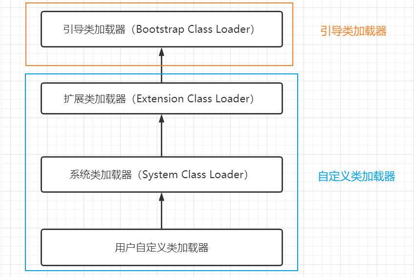

引导类加载器用C/C++编写的，嵌套在JVM内部，获取不到。

**为什么要自定义类加载器？**

- 隔离加载类
- 修改类加载的方式
- 扩展加载源
- 防止源码泄露

## 双亲委派机制

Java虚拟机对class文件采用的是按需加载，而加载某个类的class文件时，采用的是双亲委派机制，即把请求交给父类处理。

**工作原理**

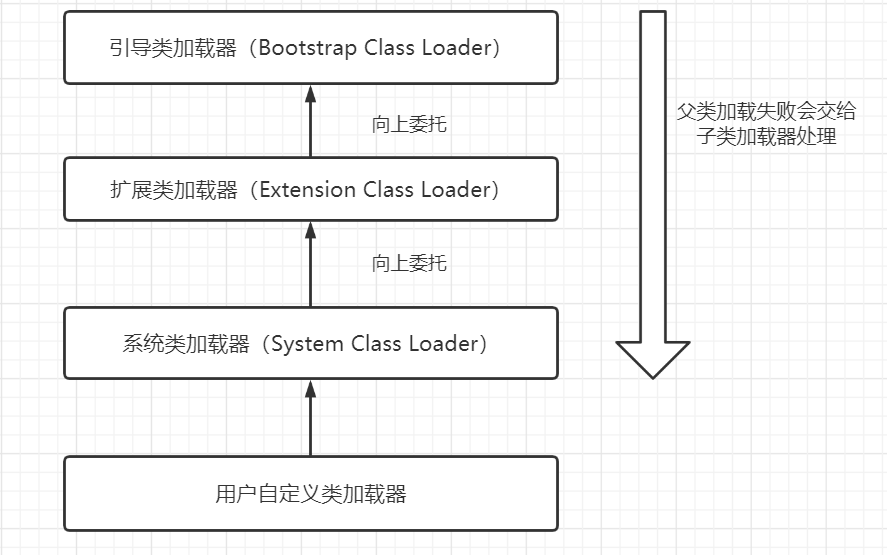

（1）如果一个类加载器收到了类加载请求，它并不会自己先去加载，而是把这个请求委托给父类加载器去执行。

（2）如果父类加载器还存在其父类加载器，则进一步向上委托，依次递归，请求最终到达引导类加载器。

（3）如果父类加载器可以完成类的加载任务，就成功返回。反之，子类加载器才会尝试自己去加载。

优势

- 避免类的重复加载
- 保护程序安全，防止核心API被随意篡改

**沙箱安全机制**

沙箱是一个限制程序运行的环境。

沙箱安全机制是将Java代码限定在虚拟机特定的运行范围中，并且严格限制代码对本地系统资源访问，通过这样的措施来保证对代码的有效隔离，防止对本地系统造出破坏。沙箱主要限制系统资源访问。

在JVM中表示两个Class对象是否为同一个类存在的两个必要条件

1. 类的完整名必须一致，包括包名。
2. 加载这个类的类加载器必须相同。

**对类加载器的引用**

如果一个类是由自定义类加载器来加载的，那么JVM会将这个类加载器的一个引用作为类型信息的一部分保存在方法区中（getClassLoader）。

当解析一个类型到另一个类型的引用的时候，JVM需要保证这两个类型的类加载器是相同的。

**类的主动使用和被动使用**

Java程序对类的使用方式分为：主动使用和被动使用

主动使用

- 创建类的实例
- 访问某个类或接口的静态变量，或对这个静态变量赋值
- 调用类的静态方法
- 反射
- 初始化一个类的子类
- Java虚拟机启动时被标明为启动类的类
- JDK7开始提供的动态语言支持

除了以上七种情况，其它的都被看作是对类的被动使用，不会导致类的初始化。

# 运行时数据区

整体结构

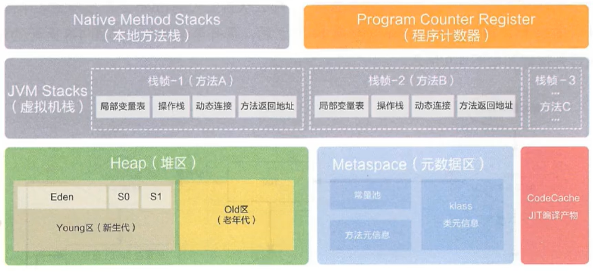

多个线程共享堆和方法区（永久代或元空间）

单个线程独占一份程序计数器、本地方法栈、虚拟机栈的空间

垃圾回收发生在堆和方法区

每个JVM只有一个Runtime实例

在Hotspot虚拟机中，每个线程都与本地线程直接映射。当一个Java线程准备好执行的时候，此时操作系统的本地线程也同时创建。线程执行终止后，本地线程也开始回收。

## 程序计数器

### PC Register介绍

作用：PC寄存器用来存储指向下一条指令的地址（即将执行的指令），由执行引擎来读取下一条指令。

特点：内存空间小，但运行速度最快，生命周期和线程生命周期保持一致

任何时间一个线程都只有一个方法在执行（当前方法）。程序计数器会存储当前线程正在执行的Java方法的JVM指令地址；如果执行的是native方法，则是为指定值（undefined）

是唯一一个在Java虚拟机规范中没有任何规定OOMError情况的区域

### 两个常见问题

1.使用PC寄存器存储字节码指令地址有什么用？

因为CPU需要来回切换不同的进程，所以需要PC寄存器来记录在当前线程所执行的位置。以免下次切换回后接着上一次的位置执行。

2.为什么PC寄存器记录是线程所私有的？

答：为了能够准确的记录每个线程当前正在执行的字节码指令的地址，最好的办法就是每个线程都有单独的PC寄存器来记录，而不是多个线程来共享一个PC寄存器。

## 虚拟机栈

### 基本概念

栈是运行时的单位，堆是存储时的单位。（栈管运行，堆管存储）

每个线程创建的时候都会创建一个对应的虚拟机栈，里面放的是栈帧，对应一次次Java方法的调用。是线程私有的。

生命周期和线程保持一致。

作用：主管Java的运行，它保存局部变量（8种基本数据类型、对象的引地址）、部分结果，并参与方法的调用和返回。

栈不存在GC问题，存在OOM

虚拟机栈的大小是允许动态扩展的或者固定不变的。如果是固定不变的，超出Java虚拟机栈允许的最大容量则会出现`StackOverflowError`异常；如果是动态扩展，如果没有足够内存空间来存放新创建的栈帧则会出现`OutOfMemoryError`异常。

如何设置栈内存大小：通过vm参数`-Xss size`

### 栈帧

每个线程都有属于自己的栈，栈的基本存储单位就是栈帧（stack frame）

在这个线程上，一个方法对应一个栈帧。

在一条活动线程中，一个时间点上，只会有一个活动的栈帧。即只有当前栈帧（栈顶栈帧）是有效的。

执行引擎运行的所有的字节码指令只针对当前栈帧进行操作。

**栈帧的内部结构**

- 局部变量表
- 操作数栈（表达式栈）
- 动态链接（指向运行时常量池的方法引用）
- 方法返回地址
- 一些附加信息

### 局部变量表

定义为一个数字数组，主要存储方法参数和定义在方法内部的局部变量。（基本数据类型、对象引用reference，方法返回地址return address）

由于虚拟机栈是线程私有的，而局部变量表存在虚拟机栈的栈帧中，所以不存在安全问题。

局部变量表的容量大小在编译的时候就确定了，保存在方法的Code属性的maximum local variables数据项中，方法运行期间不会改变其大小。

**Slot**

局部变量表最基本的存储单元就是slot（变量槽）

在局部变量表里，32位以内的类型只占一个slot（包括return address类型），64位内的类型（long、double）占用两个slot。

JVM通过访问索引来访问slot

当一个实例方法被调用的时候，它的方法参数和方法体内部定义的局部变量将会按照顺序被复制到局部变量表中的每一个slot上。

如果当前帧是由构造函数或实例方法创建的，那么该对象引用this将会存在索引为0的slot处，其余的参数按顺序排放在表中。

slot空间可以重复利用

局部变量表中的变量也是垃圾回收的根节点

### 操作数栈

操作数栈主要用来保存计算过程的中间结果，同时作为计算过程中变量临时的存储空间。

只能通过入栈、出栈的方式来访问数据