# JVM与Java体系结构

## JVM体系结构

HotSpot采用解释器与即时运行器并存的架构

多个线程共享堆和方法区

Java栈、本地方法栈、程序计数器是每个线程所私有的

## **JVM的架构模型** 

Java编译器输入的的指令流是基于栈的指令集架构，另一种是基于寄存器的指令集架构。

栈架构特点

- 可移植性好
- 指令集小、指令多、大部分是零地址指令
- 执行性能比寄存器差
- 实现同样的功能需要更多的指令

寄存器架构特点

- 完全依赖硬件，可移植性差
- 性能优秀、执行效率高
- 指令集以一地址指令、二地址指令、三地址指令为主。

## JVM生命周期

虚拟机的启动→虚拟机的执行→虚拟机的退出

Java虚拟机的启动是通过引导类加载器（bootstrap class loader）创建一个初始类来完成的，这个初始类是由虚拟机的具体实现指定的。

执行Java程序的本质就是执行的虚拟机进程

**常见的JVM**

- Sun公司，HotSpot，默认虚拟机
- Sun Classic VM（世界上第一款商用，JDK1.4被淘汰，只提供解释器）
- Exact VM（JDK1.2出现，）
- BEA ，JRockit（专注于服务器端，内部不含解析器实现，世界最快）
- IBM， J9 VM

# 类加载子系统

## 类加载子系统作用

- 负责从文件系统或者网络中加载class文件，class文件在文件开头有特定的文件标识。
- ClassLoader只负责文件的加载，是否可以运行由执行引擎决定。
- 加载的类信息存放在方法区。方法区中还会存放运行时常量池信息，可能包括字符串、字面量、数字常量（这部分常量信息是Class文件中常量池部分的内存映射）

## 类加载过程

**加载：**

1. 通过一个类的全限定名获取定义此类的二进制字节流。
2. 将这个字节流所代表的静态存储结构转化为方法区的运行时数据结构。
3. 在内存中生成一个代表这个类的Class对象，作为方法区这个类的所有数据的访问入口。

**链接：**

1. 验证（verify）：查看Class文件字节流中包含的信息是否符合要求，保证被加载类的正确性。主要包括四种验证，文件格式验证，元数据验证，字节码验证，符号引用验证。
2. 准备（prepare）：为类变量分配内存并设置默认初始值，如果是用static修饰的变量在链接阶段会被设置默认初始值，初始化阶段才会被显示赋值。不包含 final修饰的static 变量，因为final在编译的时候就会分配，准备阶段会显示初始化。不会为实例变量分配初始化，类变量分配在方法区中，而实例变量会分配在堆中。
3. 解析（resolve）：将常量池内的符号引用转换为直接引用的过程。通常发生在初始化之后。

**初始化：**

- 初始化阶段就是执行类构造器方法clinit()的过程
- ciinit()方法是Java编译器自动收集类中的所有类变量的赋值动作和静态代码块中的语句合并而来，不需要定义。
- 构造器方法中指令按语句在源文件中出现的顺序执行
- 若该类有父类，在执行自身的clinit()方法前会先执行父类的clinit()
- 虚拟机保证一个类的clinit()方法在多线程下被同步加锁

## 类加载器

JVM把类加载器分为两种：引导类加载器和自定义类加载器。

所有派生于抽象类ClassLoader的类加载器都划分为自定义类加载器。

对用户自定义类来说，默认使用系统类加载器加载。

String类使用引导类加载器进行加载→Java核心类库都是使用引导类加载器加载

引导类加载器用C/C++编写的，嵌套在JVM内部，获取不到。

**为什么要自定义类加载器？**

- 隔离加载类
- 修改类加载的方式
- 扩展加载源
- 防止源码泄露

## 双亲委派机制

Java虚拟机对class文件采用的是按需加载，而加载某个类的class文件时，采用的是双亲委派机制，即把请求交给父类处理。

**工作原理**

（1）如果一个类加载器收到了类加载请求，它并不会自己先去加载，而是把这个请求委托给父类加载器去执行。

（2）如果父类加载器还存在其父类加载器，则进一步向上委托，依次递归，请求最终到达引导类加载器。

（3）如果父类加载器可以完成类的加载任务，就成功返回。反之，子类加载器才会尝试自己去加载。

优势

- 避免类的重复加载
- 保护程序安全，防止核心API被随意篡改

**沙箱安全机制**

沙箱是一个限制程序运行的环境。

沙箱安全机制是将Java代码限定在虚拟机特定的运行范围中，并且严格限制代码对本地系统资源访问，通过这样的措施来保证对代码的有效隔离，防止对本地系统造出破坏。沙箱主要限制系统资源访问。

在JVM中表示两个Class对象是否为同一个类存在的两个必要条件

1. 类的完整名必须一致，包括包名。
2. 加载这个类的类加载器必须相同。

**对类加载器的引用**

如果一个类是由自定义类加载器来加载的，那么JVM会将这个类加载器的一个引用作为类型信息的一部分保存在方法区中（getClassLoader）。

当解析一个类型到另一个类型的引用的时候，JVM需要保证这两个类型的类加载器是相同的。

**类的主动使用和被动使用**

Java程序对类的使用方式分为：主动使用和被动使用

主动使用

- 创建类的实例
- 访问某个类或接口的静态变量，或对这个静态变量赋值
- 调用类的静态方法
- 反射
- 初始化一个类的子类
- Java虚拟机启动时被标明为启动类的类
- JDK7开始提供的动态语言支持

除了以上七种情况，其它的都被看作是对类的被动使用，不会导致类的初始化。

# 运行时数据区

整体结构

多个线程共享堆和方法区（永久代或元空间）

单个线程独占一份程序计数器、本地方法栈、虚拟机栈的空间

垃圾回收发生在堆和方法区

每个JVM只有一个Runtime实例

在Hotspot虚拟机中，每个线程都与本地线程直接映射。当一个Java线程准备好执行的时候，此时操作系统的本地线程也同时创建。线程执行终止后，本地线程也开始回收。

## 程序计数器

### PC Register介绍

作用：PC寄存器用来存储指向下一条指令的地址（即将执行的指令），由执行引擎来读取下一条指令。

特点：内存空间小，但运行速度最快，生命周期和线程生命周期保持一致

任何时间一个线程都只有一个方法在执行（当前方法）。程序计数器会存储当前线程正在执行的Java方法的JVM指令地址；如果执行的是native方法，则是为指定值（undefined）

是唯一一个在Java虚拟机规范中没有任何规定OOMError情况的区域

### 两个常见问题

1.使用PC寄存器存储字节码指令地址有什么用？

因为CPU需要来回切换不同的进程，所以需要PC寄存器来记录在当前线程所执行的位置。以免下次切换回后接着上一次的位置执行。

2.为什么PC寄存器记录是线程所私有的？

答：为了能够准确的记录每个线程当前正在执行的字节码指令的地址，最好的办法就是每个线程都有单独的PC寄存器来记录，而不是多个线程来共享一个PC寄存器。

## 虚拟机栈

### 基本概念

执行引擎每调用一个函数就会这个函数创建一个对应的栈帧并加入到虚拟机栈中，函数从调用到执行结束对应着栈帧的入栈和出栈过程。

栈内存主管程序的运行，生命周期和线程同步；

线程结束，栈内存也就跟着释放。对于栈来说不存在垃圾回收问题。

栈里放的啥：8大基本类型+对象引用+实例方法

栈是运行时的单位，堆是存储时的单位。（栈管运行，堆管存储）

每个线程创建的时候都会创建一个对应的虚拟机栈，里面放的是栈帧，对应一次次Java方法的调用。是线程私有的。

生命周期和线程保持一致。

作用：主管Java的运行，它保存局部变量（8种基本数据类型、对象的引用地址）、部分结果，并参与方法的调用和返回。

栈不存在GC问题，存在OOM

虚拟机栈的大小是允许动态扩展的或者固定不变的。如果是固定不变的，超出Java虚拟机栈允许的最大容量则会出现`StackOverflowError`异常；如果是动态扩展，如果没有足够内存空间来存放新创建的栈帧则会出现`OutOfMemoryError`异常。

如何设置栈内存大小：通过vm参数`-Xss size`

**对象实例化过程**

1. JVM会去读取指定路径下的Person.class文件，并加载进内存，并会先加载Person的父类（如果有直接父类的情况下）
2. 在堆内存中开辟空间，分配地址。
3. 并在对象空间中，对对象中的属性进行默认初始化
4. 调用对应的构造函数，进行初始化
5. 在构造函数中，第一行会先调用父类中的构造函数进行初始化（如果没有显式调用父类的构造函数，默认第一行将调用父类无参构造函数：super()）
6. 父类初始化完毕后，再对子类的属性，进行显示初始化。(在定义类属性时的初始化如：String sex=“boy”?
7. 指定构造函数中的初始化
8. 初始化完毕后，将堆内存中的地址值赋给引用变量。

### 栈帧

每个线程都有属于自己的栈，栈的基本存储单位就是栈帧（stack frame）

在这个线程上，一个方法对应一个栈帧。

在一条活动线程中，一个时间点上，只会有一个活动的栈帧。即只有当前栈帧（栈顶栈帧）是有效的。

执行引擎运行的所有的字节码指令只针对当前栈帧进行操作。

**栈帧的内部结构**

- 局部变量表
- 操作数栈（表达式栈）
- 动态链接（指向运行时常量池的方法引用）
- 方法返回地址
- 一些附加信息

### 局部变量表

定义为一个数字数组，主要存储方法参数和定义在方法内部的局部变量。（基本数据类型、对象引用reference，return address类型）

由于虚拟机栈是线程私有的，而局部变量表存在虚拟机栈的栈帧中，所以不存在安全问题。

局部变量表的容量大小在编译的时候就确定了，保存在方法的Code属性的maximum local variables数据项中，方法运行期间不会改变其大小。

**Slot**

局部变量表最基本的存储单元就是slot（变量槽）

在局部变量表里，32位以内的类型只占一个slot（包括return address类型），64位内的类型（long、double）占用两个slot。

JVM通过访问索引来访问slot

当一个实例方法被调用的时候，它的方法参数和方法体内部定义的局部变量将会按照顺序被复制到局部变量表中的每一个slot上。

如果当前帧是由构造函数或实例方法创建的，那么该对象引用this将会存在索引为0的slot处，其余的参数按顺序排放在表中。

slot空间可以重复利用

局部变量表中的变量也是垃圾回收的根节点

### 操作数栈

操作数栈在方法执行的过程中根据字节码指令往栈中写入/提取数据。

操作数栈主要用来保存计算过程的中间结果，同时作为计算过程中变量临时的存储空间。

虽然结构是数组，但只能通过入栈、出栈的方式来访问数据

Java虚拟机的执行引擎是基于操作数栈的。

**栈顶缓存技术**

将栈顶元素全部缓存在物理CPU的寄存器中，以降低对内存读写的次数，提高执行引擎的执行效率

### 动态链接

每一个帧的内部都包含一个指向运行时常量池中该帧所属方法的引用。包含这个引用的目的就是为了支持当前方法的代码能够实现动态链接。

在Java源文件被编译到字节码文件中，所有变量和 方法引用都作为符号引用保存在class文件的常量池中。

动态链接的作用就是将符号引用转换为调用方法的直接引用。

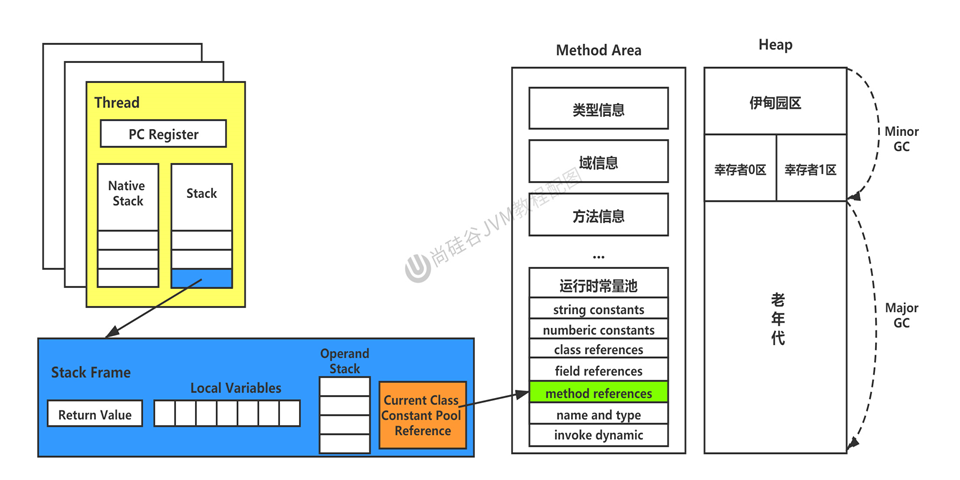

静态链接：当一个字节码文件被加载到JVM中，如果被调用的目标方法在编译期间可知，且运行期保存不变。这种情况下，将调用方法的符号引用转为直接引用的过程叫做静态链接。（对应早期绑定）

动态链接：如果被调用的方法在编译期无法确定下来，而是在程序运行的期间将调用方法的符号引用转为直接引用的过程。（对应晚期绑定）

静态方法、私有方法、final方法、实例构造器、父类方法都是非虚方法。其他的是虚方法（在编译期间无法确定的方法）。

JVM在类的方法区创建了一个虚方法表，表中存着各个方法的实际入口，用索引表来代替查找。

虚方法表的创建时间：在类加载的链接阶段被创建并初始化，类的变量的初始值准备完成之后，方法表也初始化好了。

**方法重写的本质**

- 找到操作数栈顶的第一个元素所执行的对象的实际类型，记作C
- 如果在类型C中找到与常量中的描述符合简单名称都相符的方法，则进行访问权限校验，如果通过则放回这个方法的直接引用，查找过程结束；如果不通过，则返回java.lang.illegalAccessError异常
- 否则，按照继承关系从上往下依次对C的各个父类进行第2步的搜索和验证过程
- 如果始终没有找到合适的方法，则抛出java.lang.AbstactMethodError异常

### 方法返回地址

存放调用该方法的PC寄存器的值。

如果方法是正常退出，调用者PC计数器的值作为返回地址，即调用该方法的指令的下一条指令的地址。

如果是异常退出，返回地址则根据异常表来确定。

## 本地方法栈

本地方法栈管理本地方法的调用。

允许被实现成固定或可动态扩大的内存大小。

本地方法是使用C语言编写的。

具体做法是本地方法栈中登记native方法，在执行引擎执行时加载本地方法库。

当某个线程调用一个本地方法时，它就进入了一个全新的且不受虚拟机限制的世界。它和虚拟机拥有同样的权限。

本地方法可以通过本地方法接口来访问虚拟机内部的运行时数据区。

## 堆

### 核心概述

- 一个进程对应一个JVM实例，一个JVM实例有一个运行时数据区，一个JVM实例只有一个堆内存和方法区。
- Java堆区在JVM启动的时候就被创建了，其空间大小也确定了。
- Java虚拟机规范规定堆可以处于物理上不连续的内存空间中，但在逻辑上它应被视为连续。
- 堆内存的大小是可以调节的。
- 堆被多个线程共享，在这里还可以划分线程私有的缓冲区（Thread Local Allocation Buffer TLAB）。
- 几乎所有的对象实例都保存在堆中
- 方法结束后，堆中的对象不会马上被移除，仅仅是在GC的时候才会被移除。

### 内存细分

现代垃圾收集器大部分都基于分代收集理论设计，堆空间细分为：

JDK7及以前，堆内存逻辑上分为三部分：新生区（又分为Eden区、Survivor区）、养老区、永久区

JDK8及以后，堆内存逻辑上分为三部分：新生区（又分为Eden区、Survivor区）、养老区、元空间

堆空间大小=新生区+养老区

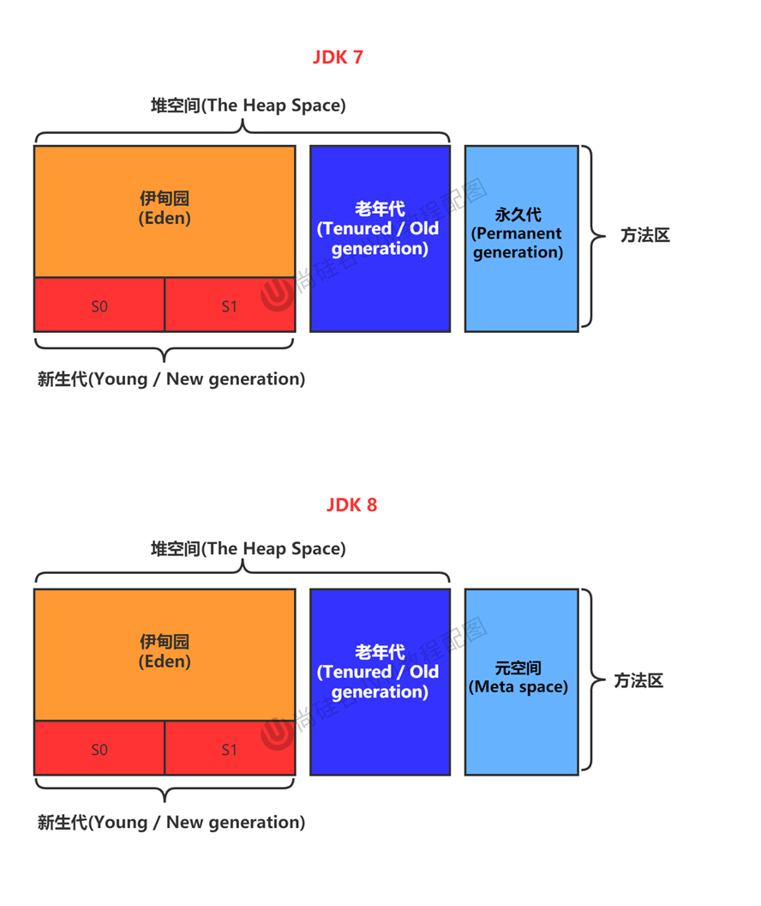

### 堆空间参数设置

1.设置堆空间大小的参数

`-Xms` 用来设置堆空间的初始内存大小

`-Xmx ` 用来设置堆空间的最大内存大小

如果堆内存的大小大于最大内存时，则会出现OOM异常

2.默认情况下堆空间的大小

初始内存大小是物理电脑内存的1/64、

最大内存大小是物理电脑内存的1/4

3.查看设置的参数：`-XX:+PrintGCDetails`

4.开发中建议将初始内存和最大内存设置为相同的值。

只要老年代的连续空间大于新生代对象的总大小或大于历次晋升的平均大小就会进行MinorGC，否则进行Full GC

### 年轻代和老年代相关参数

默认情况下，在堆内存中年轻代和老年代的结构比例是1:2，即`-XX:NewRatio=2`

在年轻代中，Eden区和两个Survivor区的默认比例是8:1:1,即`-XX:SurvivorRatio=8`

几乎所有的Java对象都是在Eden区被new出来的。

绝大部分Java对象的销毁都是在新生代中进行的。

JVM参数`-XX:UserAdaptiveSizePolicy`	关闭自适应的内存分配策略。

**新生区**

- 类诞生和成长的地方，甚至死亡；
- 伊甸园区，所有的对象都是在伊甸园区new出来的
- 幸存区（分为0区和1区）

**永久区**

这个区域常驻内存，用来存放JDK自身携带的Class对象。interface元数据，存储的是java运行时的环境和类信息，这个区域不存在垃圾回收，关闭JVM就会释放这个区域的内存

- JDK1.6之前：永久代，这个时候常量池在方法区中
- JDK1.7：永久代，但是慢慢的退化了，去永久代，常量池在堆中。
- JDK1.8之后：无永久代，常量池在元空间

元空间存在本地内存中，不在JVM内存。

### 对象分配一般过程

每次创建的对象优先在伊甸园区分配。

当Eden区满的时候会触发MinorGC，Survivor区满的时候并不会触发MinorGC，而MinorGC的清理范围就是新生区。

每次GC清理之后，空的总是伊甸园区和to区。

当老年代内存不足的的时候会触发MajorGC，而MajorGC的清理范围就是老年代，经过MajorGC后，老年代内存还不足就会出现OOM。

在轻GC清理伊甸园区的过程中活下来的对象放到S0区。如果新生区满了，在重GC清理新生区的过程中活下来的对象（历经15次MinorGC）放到养老区。

总结：

- 针对S0区、S1区：复制后有交换，谁空谁是to
- 关于垃圾回收：频繁地在新生代发生，很少在老年代发生，几乎不在永久区/元空间发生。

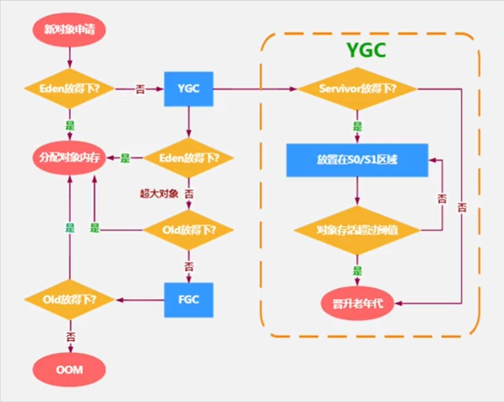

### MinorGC、MajorGC和FullGC

GC的作用区域在堆和方法区

JVM在进行GC时，并不是对这三个区域统一回收，大部分是对新生区进行回收。

对于HotSpotVM的实现，它里面的GC按照回收区域分为两类：部分收集（Partial GC）、整堆收集（Full GC）。

部分收集：不是完整的收集整个Java堆的垃圾收集，其中又分为：

- 新生代收集（Minor GC/Young GC）：只是新生代（Eden、S0、S1）的垃圾收集。
- 老年代收集（Majorr GC/Old GC）：只是老年代的垃圾收集。
  - 目前，只有CMS GC会有单独收集老年代的行为。
- 混合收集（Mixed GC）：收集整个新生代和部分老年代的垃圾。
  - 目前，只有G1 GC会有这种行为。

 整堆收集：收集整个Java堆和方法区的垃圾。

MinorGC触发机制：Eden区满时会触发，survivor区满时不会触发。

MinorGC会触发STW，暂停其他用户的线程，等垃圾回收结束，用户线程才恢复运行。

MajorrGC触发机制：老年代区满时会触发。

FullGC触发机制：

1. 调用System.gc()时，系统建议执行FullGC，但是不是必然执行。
2. 老年代空间不足。
3. 方法区空间不足。
4. 通过MinorGC后进入老年代的平均大小大于老年代的可用内存大小。
5. 由Eden区、From区向To区复制时，对象大小大于To区可用内存，则把该对象转入老年代，且老年代可用内存小于该对象大小。

### OOM和GC

| Space      | OOM  | GC   |
| ---------- | ---- | ---- |
| 程序计数器 | ✖    | ✖    |
| 虚拟机栈   | ✔    | ✖    |
| 本地方法栈 | ✔    | ✖    |
| 堆         | ✔    | ✔    |
| 方法区     | ✔    | ✔    |

### 内存分配策略

- 优先分配到Eden
- 大对象直接分配到老年代
- 长期存活的对象分配到老年代
- 动态对象年龄判断
  - 如果survivor区中相同年龄的所有对象大小的总和大于Survivor空间的一半，年龄大于等于该年龄的对象可以直接进入老年代，无需达到阈值要求的年龄。
- 空间分配担保（`-XX:HandlePromotionFailure`）

### TLAB

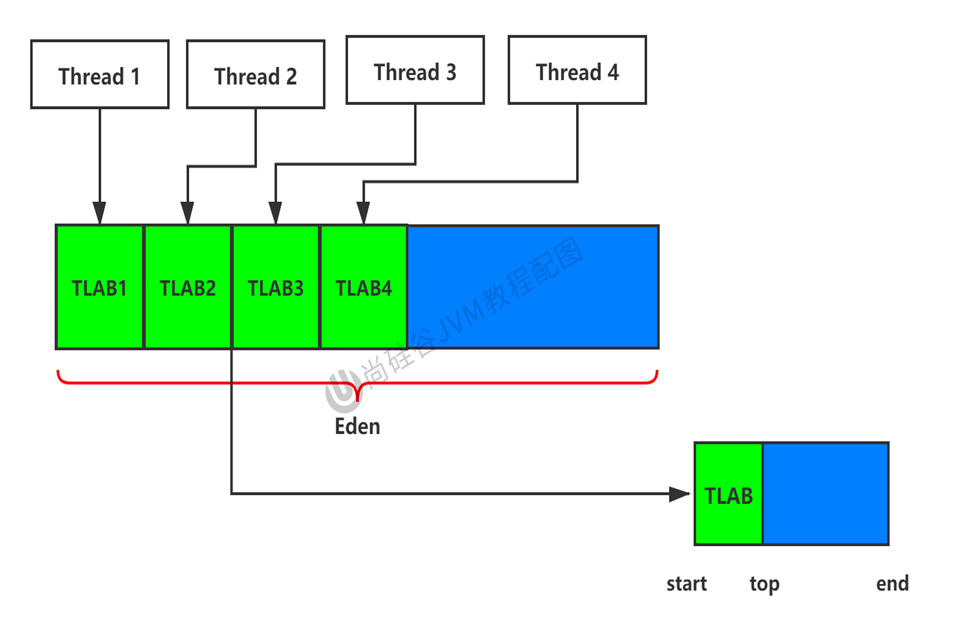

TLAB全称Thread Local Allocation Buffer

从内存模型的角度来讲，对Eden区再继续进行划分，JVM为每个线程分配了一个私有缓存区域。

多线程同时分配内存时，使用TLAB可以避免非线程安全问题，同时还能提高内存分配的吞吐量，我们将这种分配方式叫做快速分配策略。

可以通过`-XX:UseTLAB`进行设置

JVM将TLAB作为内存分配首选

默认情况下，TLAB空间占整个Eden空间的1%

一旦对象在TLAB空间分配失败，JVM则会通过加锁机制确保数据操作的原子性，从而直接在Eden中分配内存。

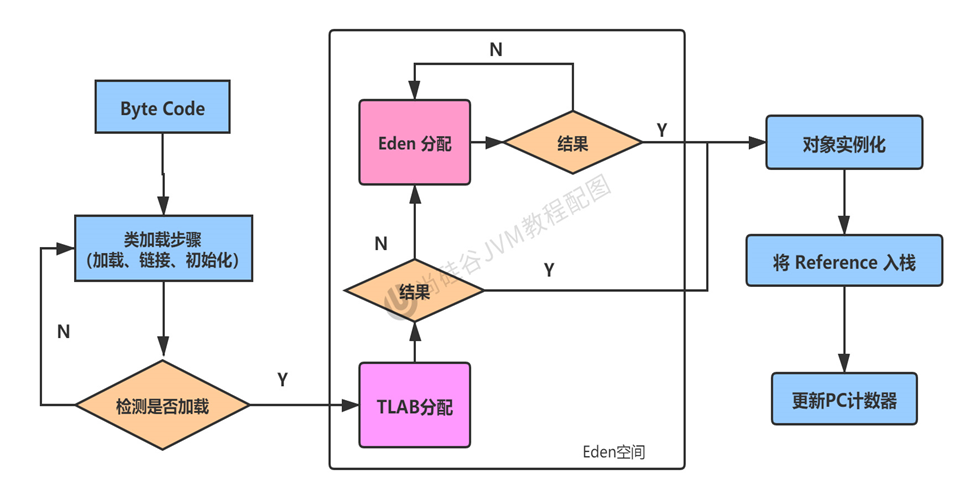

### 逃逸分析

在Java虚拟机中，对象是在堆中分配内存，如果经过逃逸分析后发现，一个对象并没有逃逸出方法的话，那么有可能被优化成栈上分配。

逃逸分析是一种可以有效减少Java程序中同步负载和内存堆分配压力的跨函数全局数据流分析算法。

逃逸分析的基本行为就是分析对象的动态作用域：

- 当一个对象在方法中被定义后，对象只在方法内部使用，则认为没有发生逃逸。
- 当一个对象在方法中被定义后，它被外部引用，则认为发生逃逸。

如何快速判断是否发生了逃逸：看new的对象实体是否有可能在方法外被调用。

JDK7以后，HotSpot就默认开启了逃逸分析。

在服务器端模式才会开启逃逸分析。

#### 代码优化

（1）栈上分配

将堆分配转化为栈分配。如果一个对象在子程序中被分配，要使指向该对象的指针永远不会逃逸，对象可能是栈分配的候选。

（2）同步省略

如果一个对象被发现只能从一个线程被访问到，那么对于这个对象的操作可以不考虑同步。

在动态编译代码块的时候，JIT编译器可以借助逃逸分析来**判断同步块所使用的锁对象是否只能被一个线程访问而没有发布到其他线程**。如果没有，那么JIT编译器在编译的这个同步块的时候会取消对这部分代码的同步。这个取消同步的过程叫同步省略或**锁消除**。

（3）标量替换

有的对象可能不需要作为一个连续的内存结构存在也可以被访问到，那么对象的部分（或全部）可以不存储在内存，而是存在CPU寄存器中。

在JIT阶段，如果经过逃逸分析，发现一个对象不会被外界访问的话，那么经过JIT优化，就会把这个对象拆解成若干个成员变量来替代。这个过程就是标量替换。（标量、聚合量）

默认开启

总结：**但是HotSpot虚拟机并没有应用栈上分配技术，而是用的标量替换。对象的实例还是分配在堆上。**

## 方法区

### 栈、堆、方法区之间的关系

从线程共享的角度来看

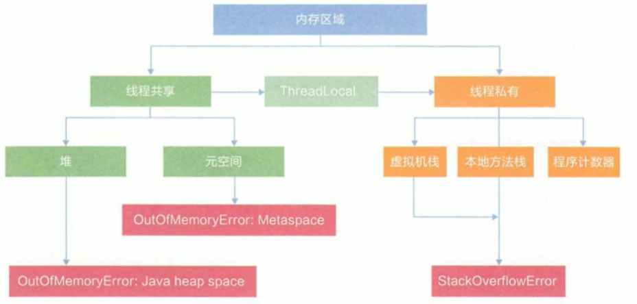

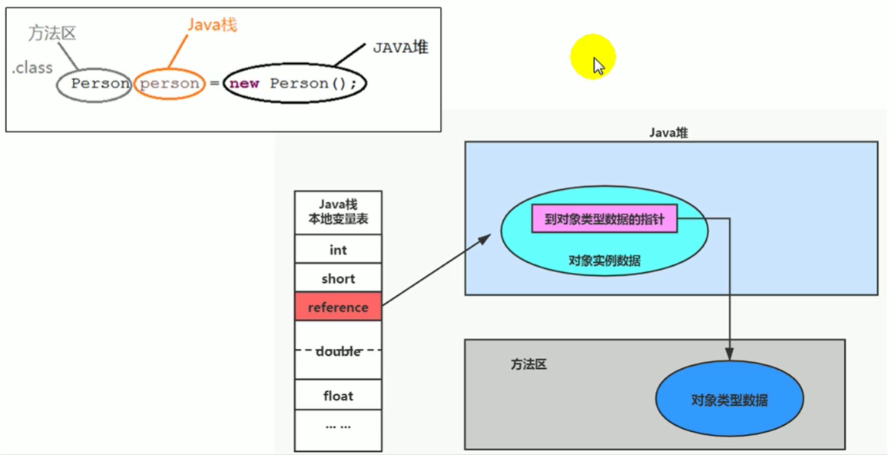

- 方法区被看作是一块独立于堆的内存空间
- 方法区和堆一样都是被线程所共享的空间
- 方法区在JVM启动的时候就被创建了，并且物理内存空间和堆一样是可以不连续的。
- 方法区的大小是可以扩展或固定大小
- 方法区的大小决定了系统可以保存多少个类。如果定义的类太多，会导致方法区溢出。
- JDK8及以后，通过`-XX:MetaspaceSize=Size`设置初始的元空间大小。

### HotSpot方法区的演变

JDK7及以前，把方法区称为永久代。

JDK8及以后，方法区改名为元空间。

在JDK8中类的元信息被保存在本地堆中（本地内存），也叫做元空间。

元空间本质和永久代类似，都是对JVM规范中方法区的实现。不过元空间不在虚拟机设置的内存中，而是使用本地内存。

### 方法区的内部结构

方法区用于存储已被虚拟机加载的类型信息、常量、静态变量、即时编译器编译后的代码缓存等。

（1）类型信息

对于每个加载的类型（类、接口、枚举、注解），JVM必须在方法区中存储以下信息：

1. 这个类型的完整有效名称（全名）
2. 这个类型直接父类的完整有效名（对于interface和java.lang.Object都没有父类）
3. 这个类型的修饰符
4. 这个类型实现的接口

（2）域信息

JVM必须在方法区中保存类型的所有域的相关信息（域名称、域类型、域修饰符）以及域的声明顺序。

（3）方法信息

JVM必须在方法区中保存所有方法的相关信息以及方法的声明顺序。

- 方法名称
- 方法返回值
- 方法参数的数量和类型（按顺序）
- 方法的修饰符
- 方法字节码、操作数栈、局部变量表及大小
- 异常表

（4）non-final的类变量

- 静态变量和类关联在一起，随着类的加载而加载。
- 类变量被类的所有实例共享，也可以直接通过类名来访问。

### 运行时常量池

- 方法区中包含了运行时常量池，字节码文件中包含了常量池。

- 当字节码文件通过类加载器加载到方法区中后，常量池结构就变成了运行时常量池。

- 常量池中存储的数据类型有：数量值、字符串值、类引用、方法引用、字段引用，用于存放编译期生成的字面量和符号引用。在类加载后就放到了方法区的运行时常量池中。
- 运行时常量池中，常量池中的符号引用变成了真实地址。
- 常量池中的数据通过索引来访问。

### 方法区的演进

只有Hotspot虚拟机才有永久代

HotSpot中方法区的变化：

| Jdk版本      | 变化                                                         |
| ------------ | ------------------------------------------------------------ |
| jdk1.6及以前 | 有永久代，静态变量存放在永久代上                             |
| jdk1.7       | 有永久代，但逐渐“去永久代”，字符串常量池，静态变量移除，保存在堆中。 |
| jdk1.8及以后 | 无永久代，类型信息，字段，方法，常量保存在元空间中（本地内存），但字符串常量池、静态变量仍在堆。 |

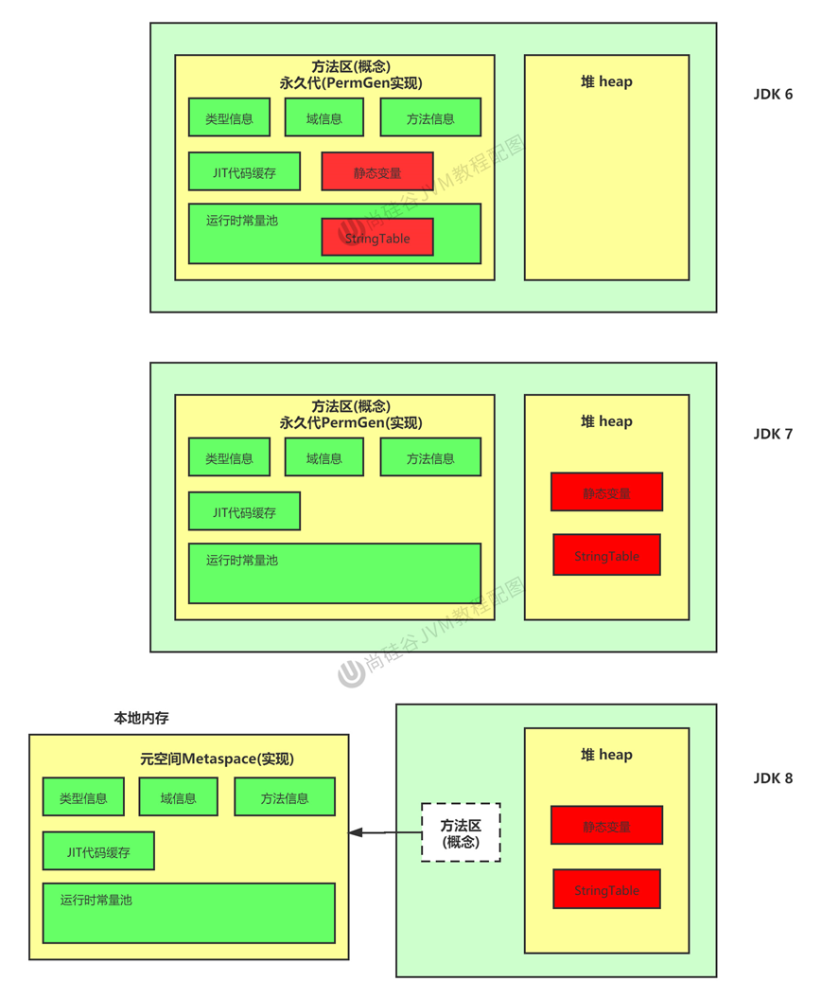

永久代为什么要被元空间替换？

1.为永久代设置空间大小是很难确定的

2.对永久代进行调优是困难的

### 方法区的垃圾回收

主要回收两部分内容：不再使用的类型，常量池中废弃的常量。

只要常量池中的常量没有被引用就可以被回收。

判断类不再被使用，要同时满足以下条件：

- 该类的所有实例已经被回收，在Java堆中不存在该类和其子类的实例。
- 加载该类的类加载器已经被回收。
- 该类对应的Class对象没有被引用。

满足之后，才允许被回收，但也只是可能。

### 对象实例化、内存布局和定位访问

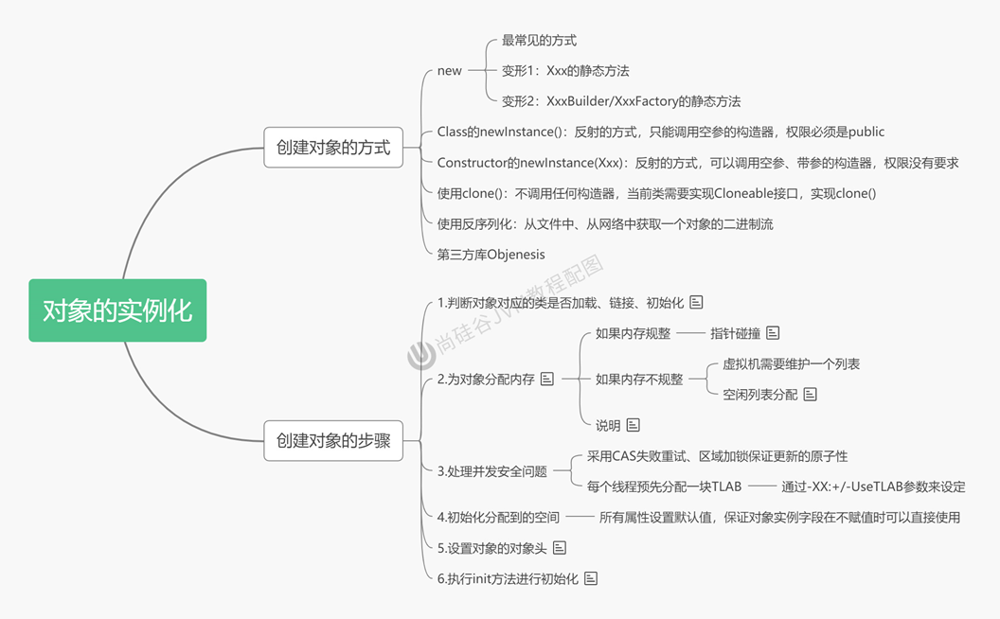

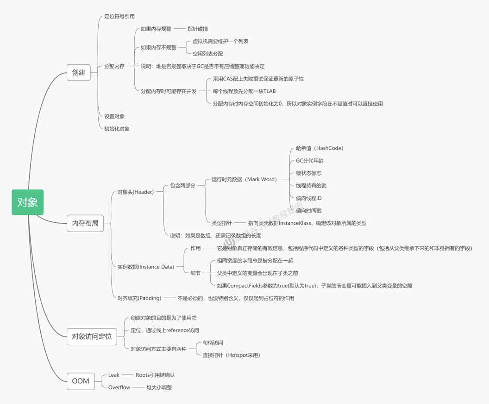

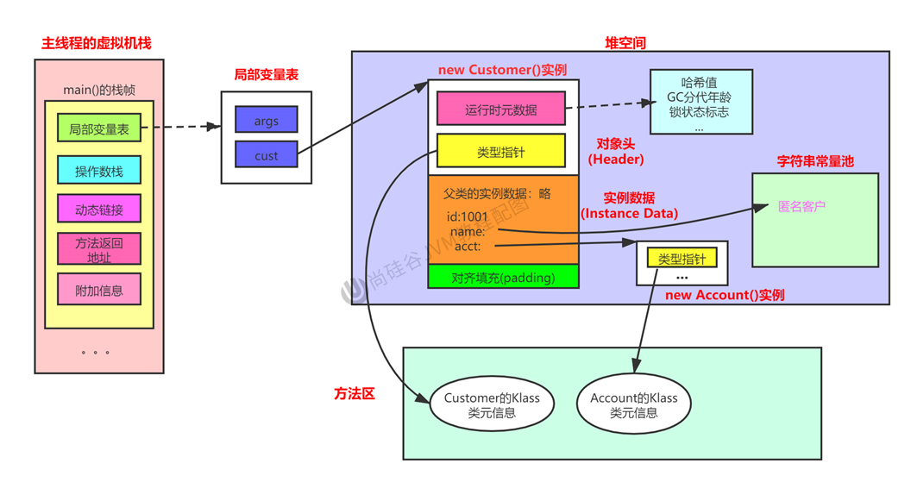

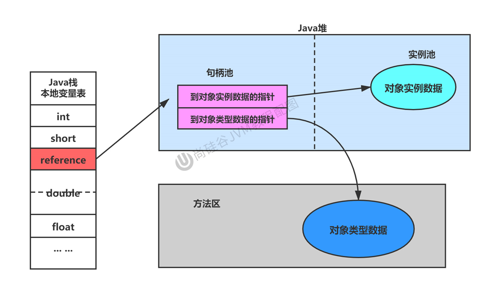

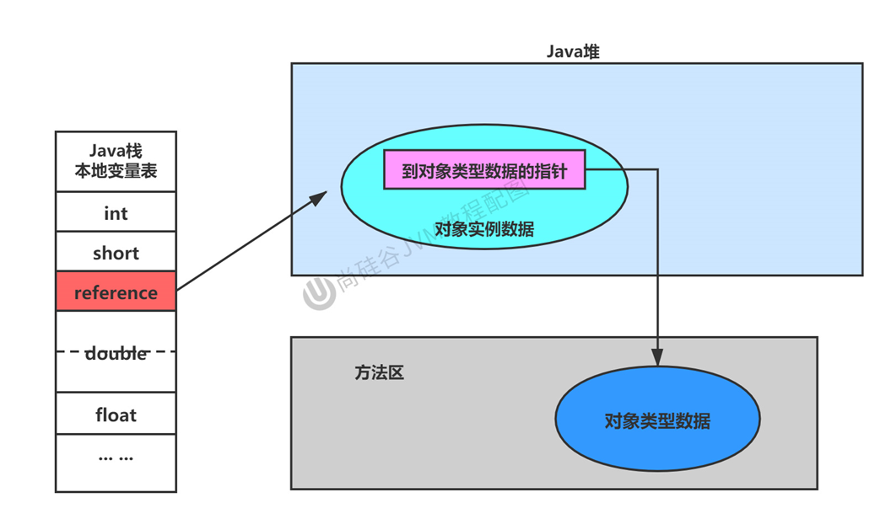

# 执行引擎

执行引擎的作用就是将字节码文件编译为本地的机器指令。

执行引擎的工作过程

1. 执行引擎根据程序计数器所存放的指令来执行对应的指令操作
2. 每执行完一次指令操作后，程序计数器就会更新下一条被需要执行的指令。

Java代码编译执行过程：

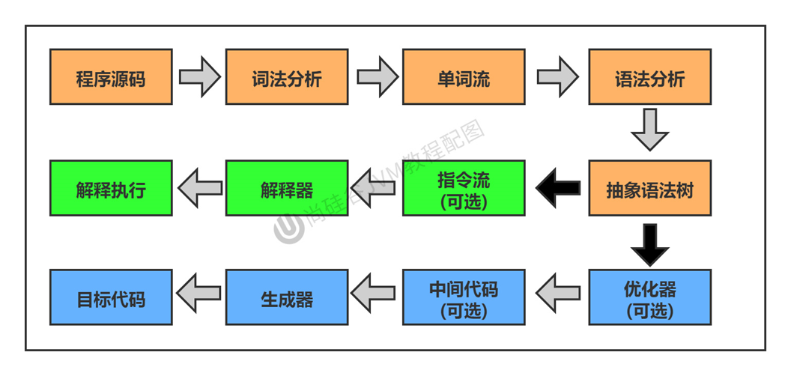

解释器：当Java虚拟机启动时候会根据预定义的规范来对字节码进行逐行解释，将每条字节码文件中的内容翻译成对应的机器指令。

JIT编译器：虚拟机将源代码直接编译成与本地机器相关的机器语言。

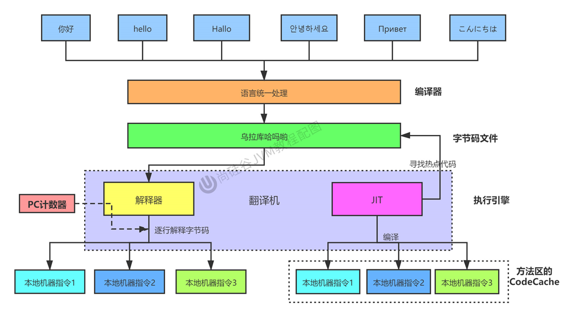

HotSpot虚拟机采用的是解释器和JIT编译器并存的架构

## 编译器

编译器分为三种：

- 前端编译器（把.java文件转换成.class文件的过程），SUN的javac
- 后端编译器（将字节码转换成机器指令，如JIT编译器），Hotspot的C1、C2编译器
- 静态提前编译器（直接将.java文件编译成本地机器代码的过程，如AOT编译器），GCJ、JET

是否启用JIT编译器根据代码被调用的频率来决定，JIT编译器会对这些热点代码进行深度优化，将其直接编译为机器指令。

HotspotVM所采用的的热点探测方式是基于计数器的热点探测。

计数器又分为方法调用计数器（用于统计方法的调用的次数，在一段时间内）和回边计数器（用于统计循环体执行的循环次数）。

方法调用计数器：

- 默认阈值在client模式下是1500次，server模式下是10000次。超过这个阈值就会触发JIT编译器。
- 阈值通过参数`-XX:CompileThreshold`来设置

HotspotVM内嵌两个JIT编译器，分别是Client Compiler（C1）、Server Compiler（C2）：

- `-client`，C1编译器会对字节码进行**简单和可靠的优化，耗时短**。编译速度更快。

- `-server`，C2进行**耗时较长的优化以及激进优化**，优化后的代码执行效率更高。

| Client编译器的优化策略                                       | Server编译器的优化策略                     |
| ------------------------------------------------------------ | ------------------------------------------ |
| 方法内联：将引用的函数代码编译到引用点，以减少栈帧的生成，减少参数传递和跳转过程。 | 标量替换：用标量值替代聚合对象的属性值     |
| 去虚拟化：对唯一的实现类进行内联                             | 栈上分配：对未逃逸的对象分配在栈上         |
| 冗余消除：在运行期间把一些不会执行的代码折叠掉               | 同步消除：清除同步操作，通常指synchronized |

## StringTable

### String的基本特性

- String的声明为final，不可被继承。
- String，表示字符串，使用""引起来。
- String实现了Serializable接口和Comparable接口。
- 在jdk1.8及以前，内部定义的是用char[] value来存储字符串数据，jdk1.9时改为了用byte[] value来存储。
- String代表的是不可变的字符序列。
  - 对字符串重新赋值，连接操作，修改字符串时，都需要重新指定内存区域赋值，不能使用原来的value进行赋值。
- 通过字面量的方式给一个字符串赋值，此时的字符串声明在字符串常量池中。
- **字符串常量池中是不会存储相同内容的字符串的**。
- String的String Pool是一个固定大小的Hashtable，默认长度时1009，jdk1.6时默认长度是1009，jdk1.7时默认长度是60013。可以使用`-XX:StringTableSize`来设置长度，从jdk8开始，设置的最小长度为1009。

字符串常量池的位置：

- jdk6在永久代
- jdk7、8在堆

StringTable的位置为什么要调整？

1. 永久代默认空间较小
2. 永久代回收频率低

### 字符串拼接操作

- 常量和常量的拼接结果在常量池，原理是编译期优化。
- 只要其中有一个是变量，结果就在堆中（不是在字符串常量池中），拼接原理是StringBuilder。
- 如果拼接的结果调用intern()方法，则主动将字符串常量池中还没有的字符串对象放在常量池中，并返回对象地址。

### intern()的使用

如果不是使用""声明的字符串则可以调用intern方法，intern方法会查询字符串常量池中是否有相同的字符串存在，如果存在，则返回对应字符串的地址，否则就将当前字符串存入常量池中。

总结intern()的使用：

- jdk1.6中，将这个字符串对象尝试放入字符串常量池中。
  - 如果串池中有，则不会放入。返回已有的串池中的对象的地址
  - 如果没有，会把**此对象复制一份**，放入串池中，并返回串池中对象的地址。
- jdk1.7起，将这个字符串对象尝试放入字符串常量池中。
  - 如果串池中有，则不会放入。返回已有的串池中的对象的地址
  - 如果没有，则会把**对象的引用地址复制一份**，放入串池中，并返回串池中的引用地址。

# 本地方法接口

**native**

凡是带了`native`关键字的：

- 说明Java的作用范围达不到了，要去调用底层C语言的库。
- 会进入本地方法栈，调用本地方法接口（JNI）

一个native method就是一个Java调用非Java代码的接口 

native关键字的由来：因为java出生的年代里C、C++横行，如果java能够调用C、C++库中的方法即能有胜出的机会，于是出现native关键字来实现这个功能。

JNI的作用就是扩展Java的使用，融合不同的编程语言为java所用

Java在内存区域中专门开辟了一块标记区域（Native method stack），用来登记native方法，在最终执行引擎执行的时候通过JNI加载本地方法库中的方法。

# GC

垃圾是指在**运行程序中没有任何指针指向的对象**，这个对象就是需要被回收的垃圾。

为什么需要GC?

答：1.

## 垃圾回收相关算法

垃圾回收主要发生在堆中，频繁清理新生代，较少清理老年代，几乎不清理方法区。

GC分为垃圾标记和垃圾清除两个阶段。

### 垃圾标记阶段

垃圾标记阶段：区分出内存中存活的对象和已经死亡的对象（不再被任何存活的对象继续引用）。已经死亡的对象会被标记，在GC执行垃圾回收时才会被清理，释放其占用的内存空间。

 判断对象存活的方式：**引用计数算法**、**可达性分析算法**

#### 引用计数算法

概念：对每个对象保存一个整型的引用计数器属性，用于记录对象被引用的情况。

对于一个对象A，只要有任何一个对象引用了A，那么A的引用计数器就加1，当引用失效的时候，引用计数器就减1。当计数器的值为0时，说明已没有任何对象引用此对象A了，表明GC可对A进行回收。

优点：

- 实现简单，垃圾对象易于识别。
- 判定效率高，回收没有延迟性。

缺点：

- 增加了存储空间的开销
- 增加了时间开销
- **无法处理循环引用的情况，导致Java的垃圾回收器中并没有使用这类算法**

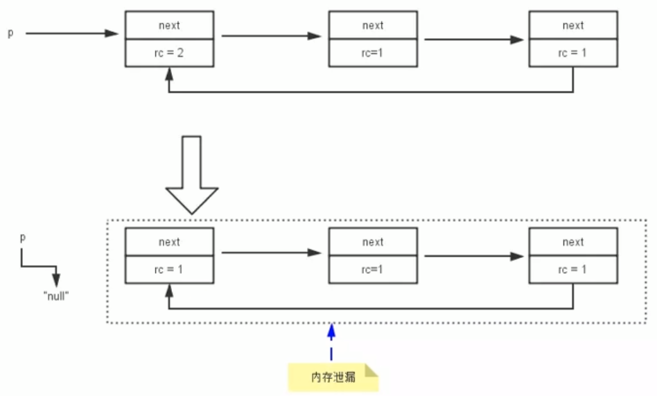

#### 可达性分析算法

解决了计数器算法无法处理循环引用的情况。

GC Roots就是一组必须活跃的引用

JVM的垃圾回收机制中，判断一个对象是否死亡，并不是根据是否还有对象对其有引用，而是通过可达性分析。对象之间的引用可以抽象成树形结构，通过根对象集合（GC Roots）作为起点，从上往下搜索被根对象集合所连接的目标对象是否可达，搜索走过的路径称为引用链， 当一个对象到GC Roots没有任何引用链相连时，则证明这个对象是不可达的，该对象会被判定为垃圾对象。

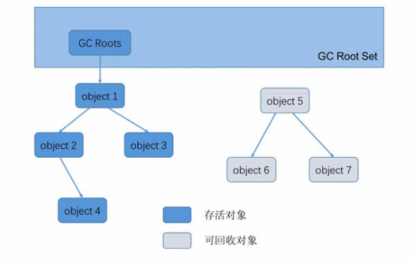

GC Roots包括以下元素：

- 虚拟机栈中引用的对象
  - 比如：各个线程被调用的方法中使用到的参数、局部变量等。
- 本地方法栈内JNI （通常说的本地方法）引用的对象
- 方法区中类静态属性引用的对象
  - 比如： Java类的引用类型静态变量
- 方法区中常量引用的对象
  - 比如：字符串常量池里的引用
- 所有被同步锁synchronized持有的对象
- Java虚拟机内部的引用
  - 基本数据类型对应的Class对象，一些常驻的异常对象（如：Nul1PointerException. OutofMemoryError） ，系统类加载器。
- 反映java虚拟机内部情况的JMXBean， JVMTI中注册的回调、本地代码缓存等。

除了这些固定的GC Roots集合以外，根据用户所选用的垃圾收集器以及当前回收的内存区域不同，还可以有其他对象“临时性”地加入，共同构成完整GC Roots集合。比如：分代收和局部回收（Partial Gc）

如果只针对Java堆中的某一块区域进行垃圾回收（比如：典型的只针对新生代） ，必须考虑到内存区域是虚拟机自己的实现细节，更不是孤立封闭的，这个区域的对象完全有可能被其他区域的对象所引用，这时候就需要一并将关联的区域对象也加入GC Roots集合中去考虑，才能保证可达性分析的准确性。

小技巧：由于Root采用栈方式存放变量和指针，所以如果一个指针，它保存了堆内存里面的对象，但是自己又不存放在堆内存里面，那它就是一个Root。

使用可达性分析算法进行判断内存是否可回收的时候，必须在一个能保障一致性的快照中进行。

#### 对象的finalization机制

finalization机制提供了对象被销毁之前的自定义处理逻辑的能力。

在垃圾回收器回收一个没有引用指向的对象之前，会调用该对象的`finalize()`方法。

不要主动去调用一个对象的finalize()方法

由于有finalize()方法的存在，**虚拟机中的对象一般处于三种可能的状态**。

- 可触及的：从根节点开始，可以到达这个对象。
- 可复活的：对象的所有引用都被释放，但是对象有可能在finalize()中复活。
- 不可触及的：对象的finalize()被调用，并且没有复活，那么就会进入不可触及状态。不可触及的对象不可能被复活，因为**finalize()只会被调用一次**。

具体过程：

判定一个对象objA是否可回收，至少要经历两次标记过程。

1. 如果对象objA到Gc Roots没有引用链，则进行第一次标记。

2. 进行筛选，判断此对象是否有必要执行finalize()方法
   1. 如果对象objA没有重写finalize()方法，或者finalize()方法已经被虚拟机调用过，则虚拟机视为“没有必要执行” ， obja被判定为不可触及的。
   2. 如果对象objA重写了finalize()方法，且还未执行过，那么objA会被插入到F—Queue队列中，由一个虚拟机自动创建的、低优先级的Finalizer线程触发其finalize()方法执行。
   3. finalizel()方法是对象摆脱死亡的最后机会，稍后GC会对F—Queue队列中的对象进行第二次标记。如果obja在finalize()方法中与引用链上的任何一个对象建立了联系，那么在第二次标记时， obja会被移出“即将回收”集合。之后，对象会再次出现没有引用存在的情况。在这个情况下， finalize方法不会被再次调用，对象会直接变成不可触及的状态，也就是说，一个对象的finalize方法只会被调用一次。

### 垃圾清除阶段

常见的垃圾收集算法：标记清除（Mark-Sweep）算法、复制算法、标记压缩算法

#### 标记清除算法

执行过程：当内存空间不足时，会停止整个程序（STW）来进行标记-清除，两项工作。

- 标记：Collector从引用根节点开始遍历，标记所有被引用的对象。一般是在对象的Header中记录为可达对象。
- 清除：Collector对堆内存进行线性遍历，如果发现某个对象不是可达对象，则将其回收。

这里所谓的清除，不是真的把垃圾对象的内存空间中的数据进行清空（数据还在），而是把需要清除的对象的地址保存在空闲的地址列表里。下次有新对象需要加载时，如果清除完垃圾对象的空闲空间够放下，就将新对象的数据覆盖掉原垃圾对象的数据。

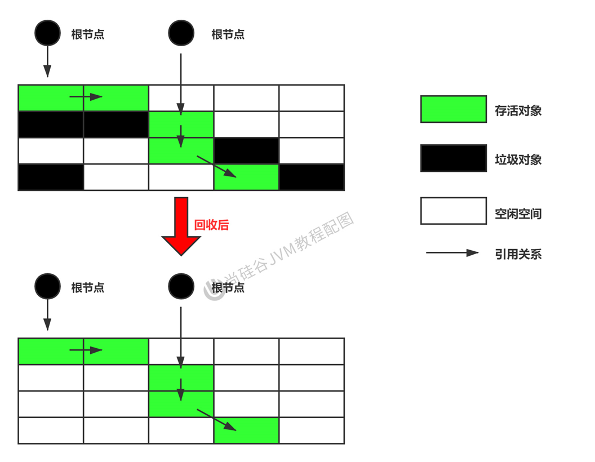

优点：

- 不需要额外的空间
- 容易实现和理解

缺点：

- 效率不算高（需要两次遍历）
- 在进行GC的时候，需要停止应用程序。
- 这种方式清理出来的空闲内存是不连续的，会产生内存碎片，且需要一个空闲列表来维护。 

#### 复制算法

核心思想：

将活着的内存空间分为两块，每次只使用其中一块，在垃圾回收时将正在使用的内存中的存活对象复制到未被使用的内存块中，之后清除正在使用的内存块中的所有对象，交换两个内存的角色，最后完成垃圾回收。

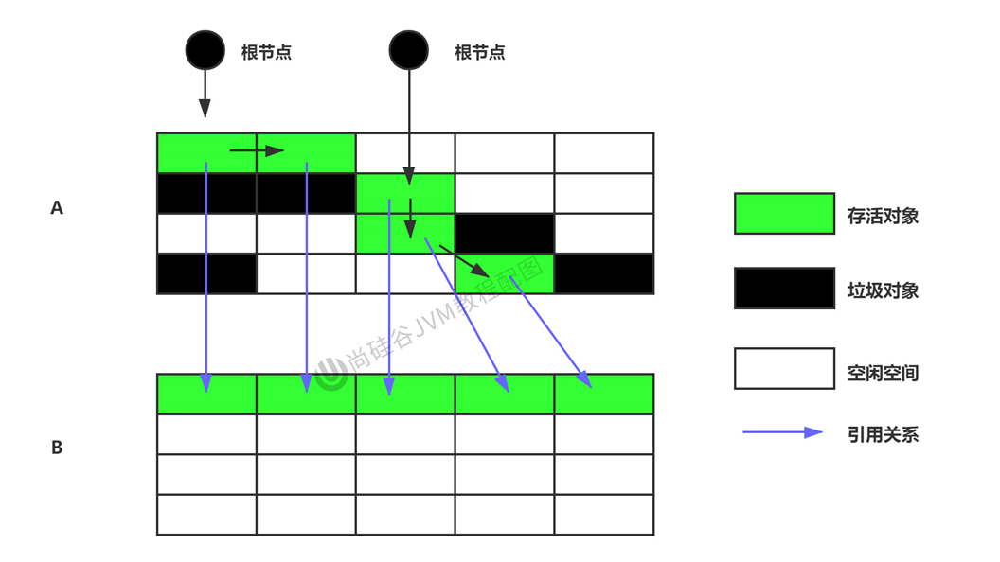

优点：

- 复制过去之后，保证了空间的连续性，没有内存碎片
- 没有标记和清除过程，实现简单、运行。

坏处：

- 浪费了内存空间（多了一半区域是空的，to区）

复制算法最佳使用场景：对象存活度较低的时候，新生区

#### 标记压缩算法

基于标记清除之后再进行内存碎片整理。

标记清除算法是一种非移动式的回收算法，而标记压缩是移动式的。

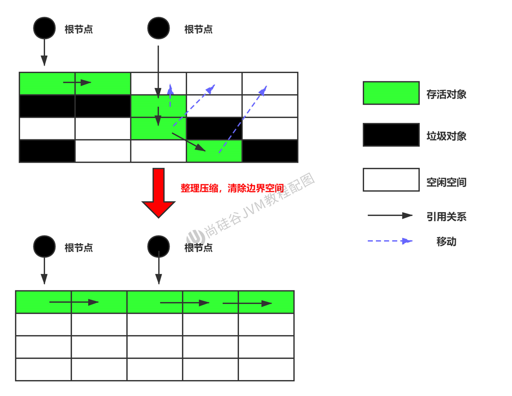

优点：弥补了标记清除算法和复制算法的不足。

**总结**

内存效率：复制算法>标记清除>标记压缩（时间复杂度）

内存整齐度：复制算法=标记压缩>标记清除

内存利用率：标记压缩>标记清除>复制算法

新生代：

- 存活率低
- 复制算法

老年代：

- 区域大，存活率高
- 标记清除+标记压缩混合实现